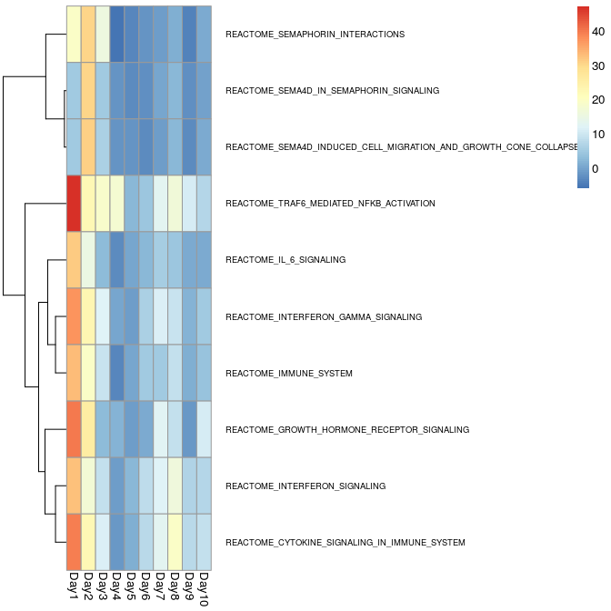

# Example HW4: limma, voom, pheatmap, and camera
Brian High  
March 2, 2015  

## Assignment

You will have to analyze the RNA-seq data presented in:
Henn, A. D. et al. [High-resolution temporal response patterns to influenza vaccine reveal a distinct human plasma cell gene signature.](http://www.ncbi.nlm.nih.gov/pubmed/23900141) Scientific Reports 3, 2327 (2013).
  
1. Get the [data](http://www.ncbi.nlm.nih.gov/geo/query/acc.cgi?acc=GSE45735) from [GEO](http://www.ncbi.nlm.nih.gov/geo/). Please look at the [class](https://github.com/raphg/Biostat-578/blob/master/RNA-seq.md) [lecture](https://github.com/raphg/Biostat-578/blob/master/GSEA.md) slides as we've done it already
2. Use [voom](http://genomebiology.com/2014/15/2/R29) and [limma](http://www.bioconductor.org/packages/release/bioc/html/limma.html) to find genes that are differentially expressed at each time point compared to baseline (day 0). Use an [FDR](http://en.wikipedia.org/wiki/False_discovery_rate) cutoff of 0.01.
Display your results using [pheatmap](http://cran.r-project.org/web/packages/pheatmap/index.html) showing the [log](http://seqanswers.com/forums/showthread.php?t=41882) [fold-change](http://en.wikipedia.org/wiki/Fold_change) of the differentially expressed genes grouped by time point.  
3. Perform a [GSEA](http://www.broadinstitute.org/gsea/index.jsp) analysis using [camera](http://bioconductor.org/packages/release/bioc/html/CAMERA.html) and the [MSigDB](http://www.broadinstitute.org/gsea/msigdb/index.jsp) Reactome pathway gene signatures. Display your results using [pheatmap](http://cran.r-project.org/web/packages/pheatmap/index.html), again group by timepoint. This is similar to what we've [done in class](https://github.com/raphg/Biostat-578/blob/master/GSEA.md).

## Setup

### Set `knitr` settings


```r
# Set some global knitr options
library("knitr")
opts_chunk$set(tidy=FALSE, cache=TRUE, messages=FALSE, 
               fig.width=8, fig.height=10)
```

### Install packages


```r
packages <- c("GEOquery", "limma", "GSEABase", "pheatmap")
source("http://bioconductor.org/biocLite.R")
```

```
## Bioconductor version 3.0 (BiocInstaller 1.16.1), ?biocLite for help
```

```r
for (pkg in packages)
{
    require(pkg, character.only = TRUE, quietly = TRUE) || biocLite(pkg) 
}
```

### Load packages


```r
library(GEOquery)
library(limma)
library(pheatmap)
library(GSEABase)
```

## Get data from GEO 


```r
library(GEOquery)

# Create the data folder if it does not already exist
datadir <- "./Data/GEO/"
dir.create(file.path(datadir), showWarnings = FALSE, recursive = TRUE)

# Construct the data file path from the accession code and folder path
accession <- "GSE45735"
datafile <- paste(c(datadir, accession, "_series_matrix.txt.gz"), collapse = "")

# Download the datafile if it does not already exist and load into eset
if (file.exists(datafile)) {
    # Load the data from the previously downloaded data file using getGEO
    gd <- getGEO(filename = datafile) # getGEO returns an "S4" object
} else {
    # Query GEO for the GEO object matching the accession number
    gd <- getGEO(accession, destdir = datadir)[[1]]  # getGEO returns a "list"
}
```

```
## ftp://ftp.ncbi.nlm.nih.gov/geo/series/GSE45nnn/GSE45735/matrix/
## Found 1 file(s)
## GSE45735_series_matrix.txt.gz
## File stored at: 
## ./Data/GEO//GPL10999.soft
```

```r
# Dowload the supplimental data files if they are not already downloaded
if (length(list.files(datadir, pattern="_pbmc.txt.gz"))==0) {
    getGEOSuppFiles(accession, makeDirectory = FALSE, baseDir = datadir)
}
```

```
## ftp://ftp.ncbi.nlm.nih.gov/geo/series/GSE45nnn/GSE45735/suppl/
```

```r
pd <- pData(gd)
```

### Subset the SuppFiles data

This was adapted from the [lecture](https://github.com/raphg/Biostat-578/blob/master/RNA-seq.md) slides.


```r
pd <- pData(gd)

## note the regular expression to grep file names
files <- list.files(path = datadir, 
                    pattern = paste(c(accession, "_T.*.txt"), collapse = ""), 
                    full.names = TRUE) 
file_list <- lapply(files, read.table, sep = "\t", header = TRUE)
```

This came straight from the [lecture](https://github.com/raphg/Biostat-578/blob/master/GSEA.md) slides.


```r
# Subset to only those rows where Gene contains only
# non-space characters This addresses problems with T14 file
# containing 28 invalid rows at end of file
file_list <- lapply(file_list, function(file_list) subset(file_list, 
    grepl("^[^[:space:]]+$", Gene)))
# Remove duplicated rows
file_list_unique <- lapply(file_list, function(x) {
    x <- x[!duplicated(x$Gene), ]
    x <- x[order(x$Gene), ]
    rownames(x) <- x$Gene
    x[, -1]
})

# Take the intersection of all genes
gene_list <- Reduce(intersect, lapply(file_list_unique, rownames))
file_list_unique <- lapply(file_list_unique, "[", gene_list, 
    )
matrix <- as.matrix(do.call(cbind, file_list_unique))

# Clean up the pData
pd_small <- pd[!grepl("T13_Day8", pd$title), ]
pd_small$Day <- sapply(strsplit(gsub(" \\[PBMC\\]", "", pd_small$title), 
    "_"), "[", 2)
pd_small$subject <- sapply(strsplit(gsub(" \\[PBMC\\]", "", pd_small$title), 
    "_"), "[", 1)
colnames(matrix) <- rownames(pd_small)
```

## Use voom and limma

> Use voom and limma to find genes differentially expressed [...]

This came straight from the [lecture](https://github.com/raphg/Biostat-578/blob/master/GSEA.md) slides.


```r
## add one to count
new_set <- ExpressionSet(assayData = matrix+1)
pData(new_set) <- pd_small

## voom + limma
design <- model.matrix(~subject+Day, new_set)
new_set_voom <- voom(new_set, design = design)
lm <- lmFit(new_set_voom, design)
eb <- eBayes(lm)
```

> Find genes differentially expressed at each time point compared to baseline (day 0). Use an FDR cutoff of 0.01. 

Loop through the ten days to build a list of topTable results, one result for each day.

This code chunk was adapted with permission from Kenneth Chen's [published](https://github.com/kenlchen/HW1-kenlchen/blob/master/HW3.Rmd) homework found on Github.


```r
FDR = 0.01 #set false discovery rate
days = 10
tt = vector("list", days)
for (i in 1:days) {
  coef = paste0("DayDay", i)
  tt_temp =  topTable(eb, coef=coef, number=Inf, sort.by="none")
  tt[[i]]=tt_temp
}

# There are no genes which meet FDR < 0.01 for all the days, so find set of 
# genes which meets FDR < 0.01 on at least one day wrt baseline of Day 0
FDR = 0.01 #set false discovery rate
genes = dim(tt[[1]])[1]
keep = logical(genes)
for (i in 1:genes) {
  for (tt_temp in tt) {
    if (tt_temp$adj.P.Val[i] < 0.01) {
      keep[i] = TRUE
    }
  }
}
```

## Make a heatmap

> Display your results using pheatmap showing the log fold-change of differentially expressed genes grouped by time point.

This code chunk was adapted with permission from Kenneth Chen's [published](https://github.com/kenlchen/HW1-kenlchen/blob/master/HW3.Rmd) homework found on Github.


```r
# Each element will be a vector of logFC values for genes where keep is TRUE 
# (ie. there is one day were the FDR for that gene < 0.01), index corresponds 
# to day 
diffGenes = vector("list", days)
for (i in 1:days) {
  diffGenes[[i]] = tt[[i]]$logFC[keep]
}

# Bind the list together into a single data frame, genes on rows, 
# days on columns, elements are logFC
diffGenes2 = do.call(cbind, diffGenes) 

# Get gene names
rownames(diffGenes2) = rownames(tt[[1]][keep,])

# Set column names to days
colnames(diffGenes2) = sapply(1:10, function(x) { paste0("Day ", x) })

# Draw heatmap
pheatmap(as.matrix(diffGenes2), cluster_cols = FALSE)
```

 

## Perform a GSEA analysis

> Use camera and the MSigDB Reactome pathway gene signatures.

### Convert gene sets to gene indices

This is from the [lecture](https://github.com/raphg/Biostat-578/blob/master/GSEA.md) slides.

The C2 symbols GMT file can be downloaded from [GSEA](http://www.broadinstitute.org/gsea/msigdb/collections.jsp), [free registration](http://www.broadinstitute.org/gsea/register.jsp) required.


```r
## convert gene sets to gene indices
c2_set <- getGmt("./GSEA-sets/c2.all.v4.0.symbols.gmt")
gene_ids <- geneIds(c2_set)
```

Since the `limma` function to convert the symbols to indices will vary depending on the version of `limma` you have, we will use `if` and `exists` to choose the right one.


```r
# Camera requires gene-indices. 
# Which function to use will depend on which version of limma you have.
#     http://bioconductor.org/packages/release/bioc/news/limma/NEWS
#     "symbols2indices() renamed to ids2indices()."
library(limma)
if (exists("ids2indices")) { 
    sets_indices <- ids2indices(gene_ids, rownames(new_set))
}
if (exists("symbols2indices")) {
    sets_indices <- symbols2indices(gene_ids, rownames(new_set))    
}
```

### Finding enriched gene sets over time

Construct a list of `camera` results, one result for each contrast (day).

This comes from the [lecture](https://github.com/raphg/Biostat-578/blob/master/GSEA.md) slides.


```r
## find enriched gene sets over time
res <- vector("list", length = 10)
for (i in 1:10) {
    contrast <- paste0("DayDay", i)
    cont_matrix <- makeContrasts(contrast, levels = design)
    res[[i]] <- camera(new_set_voom, sets_indices, design = design, 
        contrast = cont_matrix, sort = FALSE)
}
```

## Make another heatmap

> Display your results using pheatmap, again group by timepoint.

This comes from the [lecture](https://github.com/raphg/Biostat-578/blob/master/GSEA.md) slides.


```r
PValue <- sapply(res, function(x) {
    ifelse(x$Direction == "Up", -10 * log10(x$PValue), 10 * log10(x$PValue))
})
rownames(PValue) <- rownames(res[[1]])
PValue_max <- rowMax(abs(PValue))
PValue_small <- PValue[PValue_max > 30, ]
anno <- data.frame(Time = paste0("Day", 1:10))
rownames(anno) <- colnames(PValue_small) <- paste0("Day", 1:10)
pheatmap(PValue_small, cluster_cols=FALSE, fontsize_row = 7)
```

 
